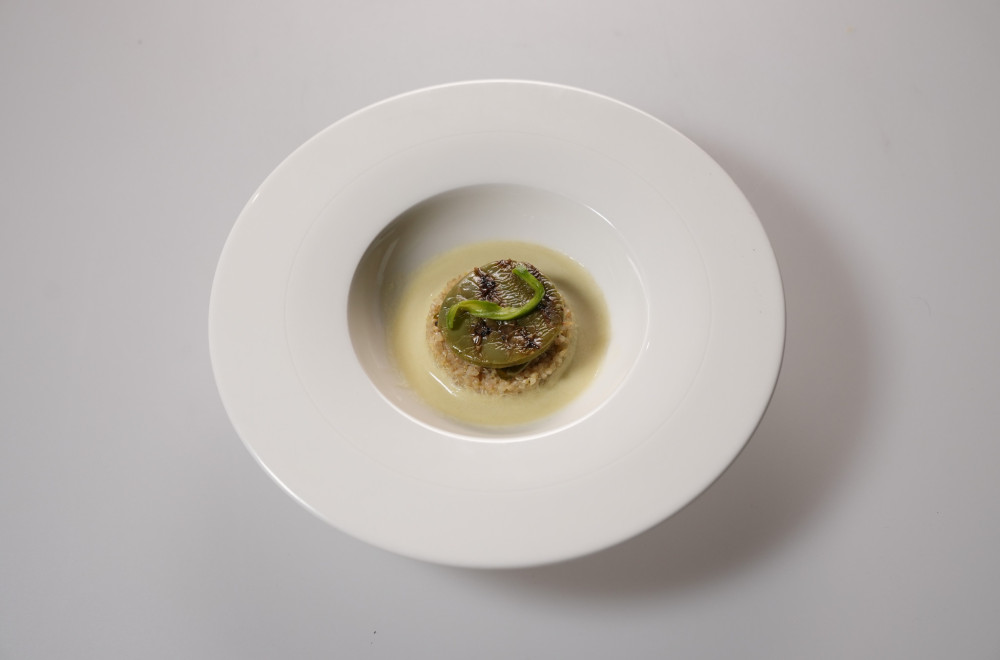

## Cactus

### Sastojci (za 3 porcije):

- Jedan veliki kaktus list
- Koren celera x 1
- Šalot x 1
- Beli luk x 2 čena
- 1 limeta
- so
- čili mrvice
- biber
- kardamom
- med
- smeđi šećer
- kokosovo mleko - 400 ml
- kinoa - 100 ml na 200 ml vode
- puter - 50 g
- maslinovo ulje - 100 ml
- biber u zrnu
- jabukovo sirće - 100 ml
- led - 1 činija

### Priprema:
Ostrugati trnje sa kaktusa ljuštilicom ili nožem, ali ne ljuštiti zelenu koricu kaktusa.

#### Krema od kaktusa i celera:
U šnezideru zagrejati 2 kašike maslinovog ulja.
Iseći 1 šalot na sitne kockice, pa dodati u ulje.
Koren celera oljuštiti i iseći na kockice. Kaktus takođe iseći na kockice.
Oljuštiti i ugnječiti 1 čen belog luka.
Dodati preko šalota i sotirati oko 10 minuta, dok celer ne dobije rumenu boju.
Posoliti po ukusu.
Preliti sa 400 ml kokosovog mleka, i 100 ml vode.
Kuvati 30 minuta.
Kada se smesa skuva, izvaditi beli luk i izblendati u mikseru.
Provući kroz sito da bi sve grudvice bili odstranjene.

#### Marinirani grilovani kaktus:
Poslastičarskim krugom izvući 3 mala kruga kaktusa i ubaciti u činiju.
Dodati dve kašike meda, tri kašike maslinovog ulja, soli, bibera i čilija po ukusu.
Sitno naseckati 1 čen belog luka.
Iscediti 1/4 limete i iseći 1 krug, pa sve pomešati i ostaviti sa strane da se marinira. (Oko 45 minuta)
Kada se kaktus marinira, zagrejati grill tiganj ili ploču i pržiti na jakoj vatri 2-3 minuta sa obe strane.

#### Ukišeljeni kaktus:
Kaktus iseći na tanke tračice, grubi žilijen.
Zagrejati 100 ml jabukovog sirća sa 3-4 kašike smeđeg šećera, 2 kašike meda, malo soli i biberom u zrnu po ukusu.
Odvojiti 100 ml hladne vode sa strane.
Kada tečnost prokuva pomešati sa vodom i preliti preko kaktusa.
Zatvoriti posudu i odneti u frižider da se hladi. Oko 45 minuta.
Kada je kaktus ukišeljen, ocediti tečnost i staviti liske kaktusa na led kako bi postale hrskave.

#### Karamelizovani kaktus:
Kaktus iseći na tanke tračice, žilijen, tako da izgleda kao tanko sečen luk.
U tiganju zagrejati 50g putera, pa dodati kaktus i 3 kašike smeđeg šećera.
Karamelizovati oko 10 minuta.
Ostaviti na pek papir da se ohladi.

#### Kinoa:
U šerpicu dodati 100 ml kinoe i 200 ml vode.
Dodati koru 1/4 limete i posoliti.
Kuvati dok kinoa ne omekša, oko 25 minuta.
Sva voda treba da ispari.
U avanu ugnječiti 2-3 kardamoma i odstraniti ljuske.
Prah od kardamoma dodati u gotovu kinou i začiniti sa sokom od 1/4 limete.
Posoliti po ukusu.

### Servis:
U duboki tanjir staviti krug kinoe, pa naliti kremom do vrha kruga.
Na kinou staviti karamelizovani kaktus, pa grilovani.
Dekorisati tanko sečenim ukišeljenim kaktusom. 

