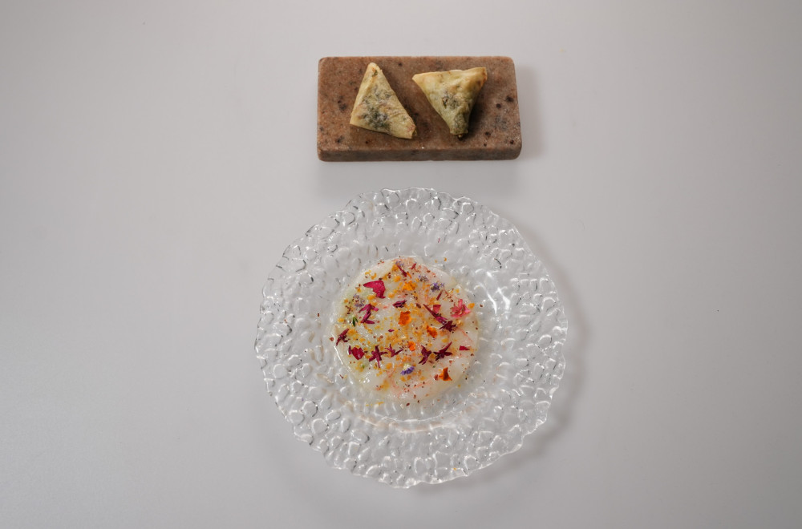

## Karpaćo sa škampima, bergamot dresingom i piticama

### Škampi:

- Škampi 2kom

Očistiti škampe. Od mesa napraviti karpaćo između dva pek papira i staviti u zamrzivač, dok ljuske i glave sačuvati za kuvanje fonda.

### Fond od škampa:
- Suncokretovo ulje 20ml
- Glave škampa 100g
- Pomorandža 25g
- Cimet štapić ⅛
- Belo vino 20ml
- Voda 300ml

Sastojke upržiti na ulju i izgnjaviti glave škampa i pomorandžu da puste svoje sokove, pa deglazirati vinom. Naliti vodom i pustiti da redukuje za 50 odsto, pa procediti.

### Krem od škampa:
- Ulje 15ml
- Komorač 50g
- Paradajza 25g
- Celera 25g
- Šargarepa 25g
- Krompira 25g
- Paradajz pire 15g
- Fond od škampa 150ml
- So ~3g
- Limunov sok

Očišćeno povrće iseckati na kockice 1x1cm, pa upržiti na ulju. Kad povrće omekša povezati paradajz pireom i naliti fondom od škampa. Pustiti da ukuva, pa izblendati sa dodatkom soli i limunovog soka. Propasirati.

### Bergamot dresing:
- Bergamot sok 20g
- Maslinovo ulje 10g
- Suncokretovo ulje 10g
- Ulje od trešnje 2g
- Emulgovati sve sastojke.

### Salsa za pitice:
- Francuski peršun 1 grančica
- Kapar 5 kom
- Inćuni 1kom
- Beli luk 1 čen
- Maslinovo ulje 50ml

Peršun, kapar, inćune i beli luk sitno preseckati, pa naliti malinovim uljem.

### Pitice:
Jednu koru spring rolls testa preseći na pola po dužini, premazati vodom, pa pripremljenom salsom. Preklopiti testo jednom po dužini, pa ga preklapati kao baklavu.
Peći oko 12 minuta na 200°C, pa zatim napuniti kremom od škampa.
Karpaćo servirati na već ohlađen tanjir.
Začiniti bergamot dresingom.
Sa botarge skinuti tamnu opnu, pa narendati preko škampa.
Jestive latice cveća preseckati, pa posuti preko škampa.
Posoliti krupnom himalajskom solju i pobiberiti kraljevskim biberom.
Sa strane servirati pitice.

