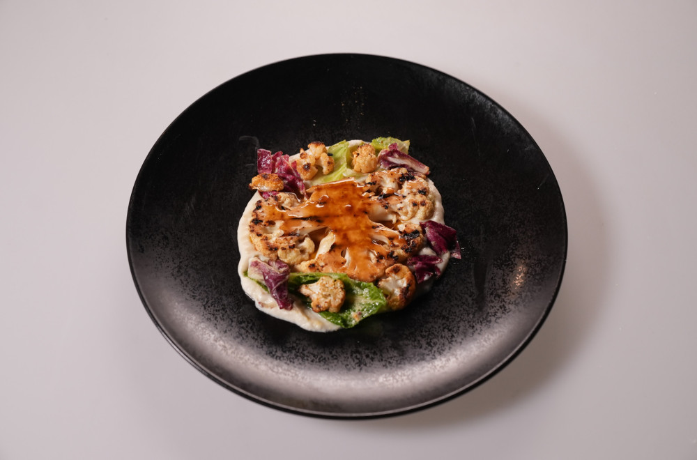

# Cauliflower

### Sastojci: 
- Dve glavice karfiola
- Soja sos
- Mirin
- Đumbir
- Beli luk
- Puter
- Mleko
- Badem
- Šalot
- Zelena salata
- Žumanca
- Dižon senf
- Vinsko sirće
- Belo vino
- Maslinovo ulje
- Ren
- So
- Biber
- Slatka paprika
- Kardamom
- Anis seme

### Priprema:
Karfiol odvojiti na manje delove, začiniti solju, biberom, slatkom paprikom, usitnjenim anisom i kardamomom, preliti maslinovim uljem i peći u rerni na 180 stepeni dok ne dobije lepu zlatnu boju.
Iz sredine glavice iseći veći komad karfiola, da bude kompaktan. Marinirati u mešavini soje sosa, mirina, đumbira i belog luka. Nakon 20 minuta grilovati na vrelom tiganju. 
Šalot sitno iseckati i sotirati sa malo belog vina dok alkohol ne ispati. Marinadu procediti pa dodati u šalot i kuvati dok se ne dobije gust sos.
Zelenu salatu oprati i pomešati sa mladim zelenim listovima karfiola. Napraviti dresing od žumanca, senfa, vinskog sirćeta, vina i ulja. Kada je odgovarajuće gustine dodati ren, so i biber. 

