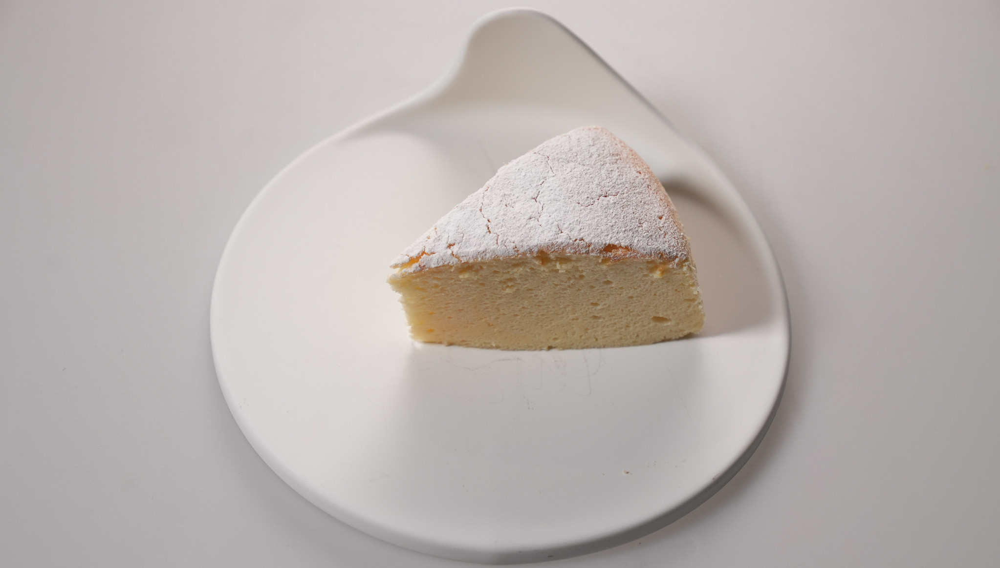

## Cheese Cake Japanese

#### Sastojci:
- 250 g krem sira
- 50 g omekšalog putera
- 140 g šećera
- 100 ml mleka
- 60 g brašna
- 20 g skrobnog brašna
- 6 jaja, odvojeno žumanca i belanca
- sok 1⁄2 limuna
- prstohvat soli

#### Uputstvo:

Razdvojite žumanca od belanaca. Belanca umutite dok ne formiraju meki sneg. Zatim dodajte šećer i prstohvat soli, pa nastavite da mutite dok se ne formira čvrst sneg.
U posudu stavite krem sir i puter, pa ih kremasto umutite na najmanjoj brzini.
Dodajte sok od limuna i jedno po jedno žumance, stalno mešajući. Umešajte mleko, pomešajte brašno i skrobno brašno, pa i njih dodajte u smesu sa sirom.
Špatulom nežno umešajte belanca u smesu sa sirom.
Rernu zagrejte na 150°C i zagrejte 1,5 l vode do ključanja.
Kalup za tortu sa odvojivim rubom (prečnika 22 – 24 cm) obložite papirom za pečenje (i dno i rubove) sa unutrašnje strane, a spolja ga obložite aluminijumskom folijom, i to u najmanje tri sloja.
U tako pripremljen kalup sipajte smesu za tortu.
Kalup stavite u veći, dublji pleh, pa sve zajedno stavite u rernu, a zatim u pleh nalijte kipuću vodu do polovine visine kalupa.
Pecite 60 minuta i ni slučajno ne otvarajte rernu pre nego što vreme istekne.
Pečenu tortu odmah izvadite iz rerne, pažljivo uklonite foliju, odvojite stranice kalupa i skinite papir za pečenje. 

