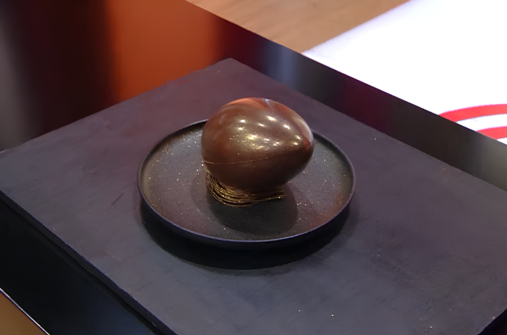

## Chocolate Egg

### DELOVI OD ČOKOLADE, LJUSKE JAJETA I GNEZDO OD ČOKOLADE
#### Sastojci:
- 500 grama crne čokolade Cacao Barry Extra Bitter Quayaquil 64%
- 2 grama MyCryo liofilizovan kakao puter Callebaut

#### Postupak:
Čokolada se temperira prema zadanim temperaturama.
U ovom slučaju temperature su :
1. Topljenje čokolade na 45C
2. Ubacivanje MyCryo i hladjenje čokolade na 27 stepeni
3. Grejanje na radnu temperaturu od 30 stepeni

Pune se kalupi za čokoladna jaja (2 kalupa po osobi, 1 kalup je dve polutke = jedno celo jaje).
Kalup se čisti špatulom i okreće na racan pleh sa papirom za pečenje tako da se višak čokolade cedi na dole i zalepi na papir. Na isti način se stvara vakuum da čokolada ne pokupi vlagu u frižideru.
Odložiti u frižider do trenutka serviranja kolača.
Od ostatka čokolade se rade čokoladna gnezda : u chilleru hladiti 2 pleha bez ivica, moraju da se zalede. Čokoladu sipati u mali dresir džak, odrezati vrh širine 2mm, izvaditi 1 pleh iz chillera i brzim potezima razvući nitne u širini pleha, 20 komada.
Odložiti dresir džak sa strane, uzeti metalnu špatulu i odseći krajeve čokolade, rukama (obavezno nositi rukavice za ovaj deo) omotati čokoladu u oblik gnezda.
Odložiti u pripremljenu posudu sa strane i staviti u frižider do trenutka serviranja kolača.
Ponoviti postupak za drugo gnezdo, sa drugim zaledjenim plehom u chilleru.

### MOUSSE OD BELE ČOKOLADE
#### Sastojci:
- 260 gr slatke pavlake 35% m.m. Debic
- korica ½ limete
- 5 gr mlevenog želatina
- 20 gr vode
- 300 gr bele čokolade Callebaut
- 400 gr slatke pavlake 35% m.m. Debic

#### Postupak:
Pomešati mleveni želatin sa vodom i ostaviti da nabubri. Ugrejati 130 gr slatke pavlake sa koricom limete, procediti i preliti preko čokolade i pripremljenog želatina, promešati da se spoji i ostaviti da se ohladi do sobne temperature (meriti termometrom na 30 stepeni).
Ručno umešati lupanu slatku pavlaku. Ohladiti mousse u frižideru.
Pred servis ga blago promešati kašikom da bude kremast i prebaciti u dresir džak.

### PEČENI ČOKOLADNI KREM
#### Sastojci:
- 100 gr vode
- 100 gr šećera
- 0.5 gr soli
- 250 gr crna Callebaut čokolada 60%
- 85 gr putera
- 2 jaja
- 30 gr šećera
- ½ štapića burbon vanila

#### Postupak:
Vodu, 100 gr šećera i so ugrejati do tačke ključanja i preliti preko čokolade i putera, mešati dok se ne istopi i ne dobije ujednačena masa. Hladiti na sobnoj temperaturi.
Jaja, 30 gr šećera i vanilu ručno mutiti žicom za mućenje dok se ne spoje sastojci. Lagano spojiti ove dve mase i izliti u kalup (masa u kalupu mora da bude visine 1 cm) i peći na 160 stepeni, max 10 minuta - u sredini mora da ostane drhtavo - da dodje do temperature cca 60stepeni. Proveravati termometrom u medjuvremenu.
Ohladiti u frižideru i auštehovati okruglom modlom.
Ovaj kolač ide na dno čokoladnog jajeta.

###  ČOKOLEŠNIK HRSKAVA ZEMLJA
#### Sastojci:
- 200 gr bele čokolade Callebaut
- 200 gr šećera
- 75 gr vode
- 80 gr crne čokolade 60% Callebaut
- 20 gr kakao Callebaut
- 20 gr maslinovog ulja (nekog finijeg)
- 50 gr seckanog lešnika (pečeni)
- 0.5 gr soli
#### Postupak:
Peći belu čokoladu na 160 stepeni dok ne dobije boju karamele i toplu usitniti pomoću metalne špatule dok je još vruća, ohladiti. 
Šećer i vodu kuvati do 135 stepeni (jako gust sirup) i sipati preko crne čokolade (u široku metalnu posudu ispod koje se nalazi krpa, zbog vreline sirupa) i žustro mešati žicom dok se ne pretvori u „prah“ sa manjim komadima čokolade, ohladiti.
U činiji spojiti sve sastojke sa kakaom i na kraju dodati ulje i mešati rukama (kao da mrvimo prstima) dok se ne spoji i ostanu komadi čokolade i lešnika i postane „sjajno“, ne sme da bude previše masno.
Ohladiti, kad se stegne razbiti zemlju na komadiće.

### SFERA “ŽUMANCE” PASSION
#### Sastojci:
- 180 gr slatke pavlake 35% m.m. Debic
- 40 gr žumanaca
- 40 gr šećera
- 180 gr mascarponea
- 6 gr mlevenog želatina
- 20 gr vode
- 90 gr pire passion fruit - marakuja
- limeta – 10 gr sok, malo korice (1/4 limete) 

#### Postupak:
Žumanca i šećer penasto umutiti. Preliti ih hladnom slatkom pavlakom, prebaciti u šerpicu i kuvati na LAGANOJ vatri do 82 stepena (paziti da ne pređe zadanu temperaturu jer će nastati kajgana umesto krema).
Pomešati mleveni želatin sa vodom i ostaviti da nabubri.
Vreli krem skloniti sa vatre.
Ubaciti spreman i nabubren želatin u vrelu masu i izmešati da se istopi (na taj način se prekida kuvanje krema i on kreće da se hladi).
Ubaciti mascarpone sobne temperature i izblendirati štapnim mikserom u gladak krem.
Na kraju umešati pire od marakuje sobne temperature i sok i koricu limuna.
Uliti u kalupe i zamrznuti.

### ZA DEKORACIJU
Zlatni sedefasti prah, potreban alat – obična četkica (mekana, kao za vodene boje)
### SERVIRANJE JAJETA
Na tanjir staviti čokoladno gnezdo, u sredinu gnezda staviti malo pečenog čokoladnog kolača, uz pomoćn istopljene čokolade zalepiti prvu polutku jajeta.
Staviti u frižider da se stegne ILI stegnuti uz pomoć hladnog spreja za čokoladu.
Na dno polutke staviti malo pečenog čokoladnog kolača, zatim beli čokoladni mousse, napraviti kašikom udubljenje u sredini i u to udubljenje staviti 2 spojene polovine zamrznutog žumanceta (dakle forma kuglice).
Na gornju stranu mousse-a sipati kašiku hrskave čokoladne zemlje.
Uzeti vruću šerpicu i u njoj zagrejati blago rubove čokoladne polutke i odmah zalepiti za donju polutku. Ohladiti hladnim sprejem za čokoladu spojeve jajeta.
Staviti ga ODMAH u frižider na minumun 5 minuta da se stegne i da se čokolada ohladi.
SLUŽITI PRAVO IZ FRIŽIDERA DA JAJE OSTANE HRSKAVO.
Posuti jaje zlatnim prahom da ima sedefasti sjaj, pred sam servis.

### SPISAK DODATNIH ALATA:
- Kalupi za čokoladna jaja
- Silikonski kalupi za sfere – žumanca
- Okrugli aušteheri
- Mali metalni nastavci za dresir džakove – okrugli
- Ice cold sprej za čokoladu
- Metalne špatule
- Termometri

