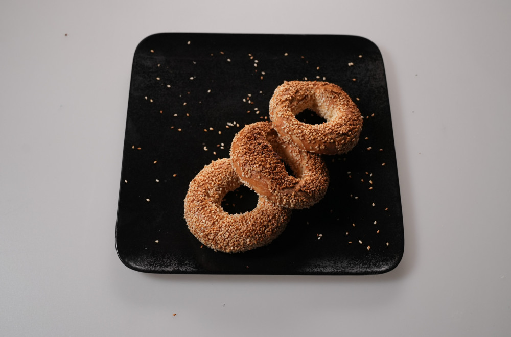

## Kuvani Djevrek

### Sastojci:
- Belo pšenično brašno, T-500, meko - 500g
- Suvi kvasac - 10g (1 kesica)
- So - 10g
- Voda - 300g 
- Beli susam - po ukusu - 1 kesica
- Rakija od dunje
- Med
- So
- Karanfilić

### Testo:
Vodu zagrejati dok ne bude malo toplija od mlake, jer će joj hladna činija spustiti temepraturu. Toplu vodu dodati u činiju, pa pomešati sa kvascem. Kvasac razmutiti, pa pustiti 2-3 minuta da nadođe.

Pomešati brašno i so, pa dodavati postepeno u vodu. Sve vreme ručno sjedinjavati smesu. Kada je smesa ujednačena prebaciti na pobrašnjenu površinu i mesiti oko 10 minuta. Testo mora biti glatko i mekano.

Testo izdeliti na jednake loptice - oko 75g. Rolati testo tako da napravite valjke, pa ih spojiti na ivicama. Formirati oblik đevreka i ostaviti da nadođe ispod krpe dodatnih 20-30 minuta.

### Voda za kuvanje:
U dublju šerpu naliti 1 l vode, 150 ml rakije od dunje, 5 kašika meda i 3 karanfilića. Dovesti do tačke ključanja, pa izvaditi karanfiliće. Posoliti vodu. Đevreke kuvati dok ne isplivaju na površinu, pa prebaciti na pek papir.

Zagrejati rernu na 220 stepeni. Kuvane đevreke uvaljati u susam, pa peći u rerni na pek papiru dok ne dobiju zlatno braon boju. Oko 15 minuta. 

