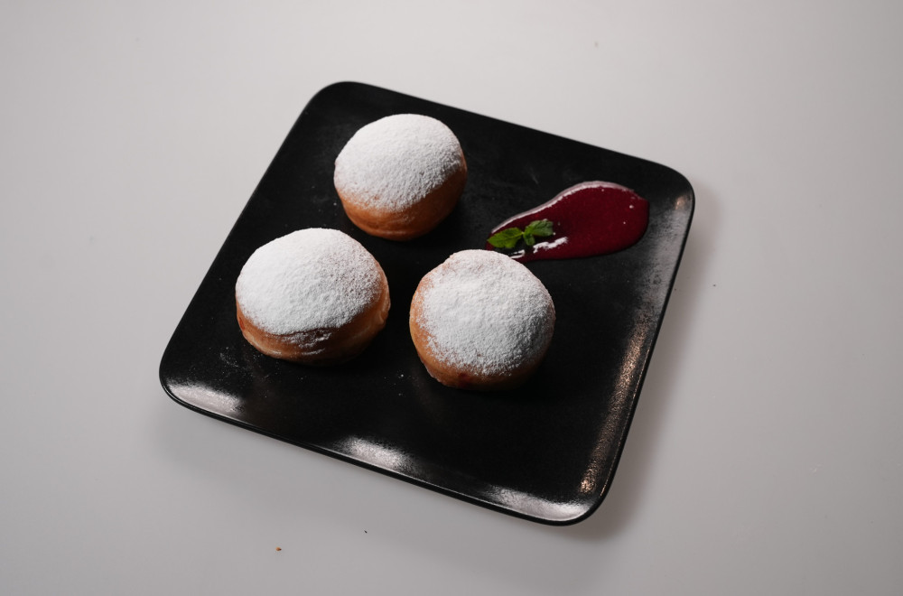

## Donuts with Raspberries and White Chocolate

### Sastojci: 
- 1 jaje
- 2 žumanca
- 50g ulja
- 500g brašna
- 10 g kvasca
- 350 ml toplog mleka
- 50g šećera
- kašičica soli
- Korica limuna

### Postupak pripreme:
Zamesiti testo i ostaviti da naraste. Zatim razvući na radnu površinu i modlom praviti krofne. Ostaviti da narastu.
Ulje zagrejati na 170 stepeni. Pržiti krofne do zlatne boje.

### Punjenje:
Maskarpone sir pomešati sa prethodno rastopljenom belom čokoladom i slatkom pavlakom. Maline kuvati sa malo vode, šećera i gustina, dodati malo limuna i list nane. Provući kroz rešetku da bude glatke strukture. Puniti krofne. 

