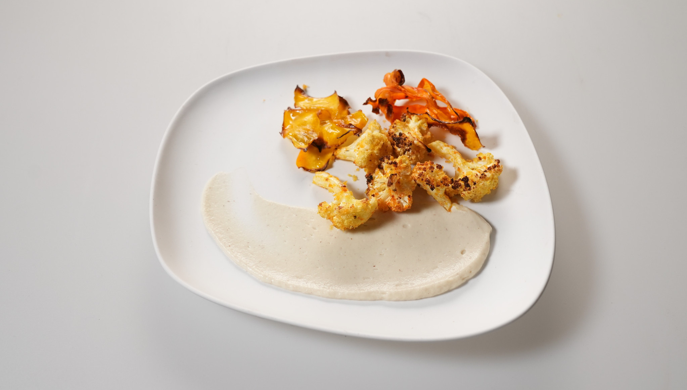

## Hrskavi karfiol na pireu od karfiola

### Sastojci:
- Bundeva
- Šargarepe
- Karfiol, 2 glavice
- Vanila
- Lešnik
- Mleko
- Panko prezle
- Puter
- Maslinovo ulje
- So
- Sušeni bosiljak
- Kari začin
- Sušeni origano
- Beli luk u prahu
- Slatka aleva paprika

### Priprema:

#### Pire od karfiola:
Jednu glavicu karfiola iseći na cvetiće, tako da odstranite tvrdo stablo iz sredine.
Istostirati lešnik na tiganju 3-4 minuta, pa istrljati ubrusom ili krpom tako da otpadne gorka ljuspica.
Karfiol i lešnik ubaciti u mleko da se kuva. Oko 1L, ili koliko mleka je potrebno da prekrije karfiol.
Doliti čašu vode u mleko kako ne bi prekipelo. Posoliti i kada proključa spustiti temperaturu na srednju vatru i kuvati dok karfiol ne omekša. Oko 35 minuta.
Kada se karfiol skuva procediti karfiol i lešnik od mleka i ubaciti u blender.
Dodati 3-4 veće kocke putera, so po ukusu.
Blendirati dok smesa ne postane u potpunosti glatka pa dodati 2-3 kašičice ekstrakta od vanile i pomešati.
Ostaviti pire sa strane do servisa.

#### Hrskavi karfiol:
Drugu glavicu karfiola očistiti tako da odstranimo tvrdu stabljiku iz sredine i ostavimo lepe cvetove, odnosno krošnjice.
Što su krošnjice manje, to će brže biti gotove.
U činiji umasirati malo maslinovog ulja u cvetiće karfiola tako da se ono ponaša kao lepak za smesu od prezli.
U drugoj činiji spojiti panko prezle, oko 2 čaše, sa kašičicom sušenog bosiljka, kašikom origana, kašikom slatke paprike, kašičicom belog luka u prahu i dve kašike kari začina. Posoliti po ukusu.
Promešati pa uvaljati karfiol u smesu.
Rasporediti na plehu sa pek papirom i peći u rerni na 190 stepeni dok karfiol ne porumeni.

#### Čips od bundeve i šargarepe:
Oguliti bundevu i odstraniti semenke.
Oljuštiti šargarepu.
Ljuštilicom ili na mandolini tanko iseći bundevu i šargarepu pa slagati na pek papir na plehu.
Posuti sa malo maslinovog ulja i začiniti solju po ukusu.
Peći u rerni na 150 stepeni oko 20 minuta ili na jačoj temperaturi (180 stepeni) oko 10 ako nemate puno vremena.
Paziti da ne zagori.
Ohladiti na pek papiru.

### Servis:
Staviti kašiku pirea na tanjir i razvući špatulom.
Ređati čips od bundeve i šargarepe naizmenično na pire i dodati hrskavi karfiol sa strane. 

