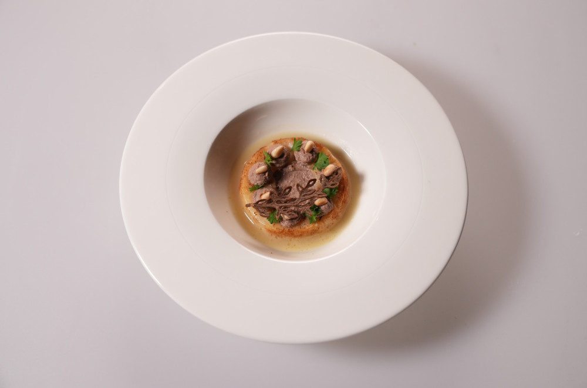

# LiverPâté

### Sastojci:  
- Pileća džigerica
- Jaja
- So
- Biber
- Cimet

Staviti sastojke u blender i dobro izblendati. Vakumirati i kuvati u vodi na oko 70 stepeni oko 25 minuta.

### Disk od celera:
- Celer
- So
- Biber
- Ruzmarin
- Puter
- Maslinovo ulje

Iseći disk od celera, začiniti i obložiti uljem. Umotati u foliju i peći u rerni dok ne omekša.
Kada omekša napraviti braon puter i kratko sotirati na braon puteru. 

### Tuli od džigerice:
- Džigerica
- So
- Biber
- Puter
- Brašno

Sve sastojke dobro izblendati da se dobije tekstura krema. Izliti na kalupe i peći u rerni oko 7 minuta. 

### Supa od celera: 
- Celer
- Rum
- So
- Biber
- Bujon
- Maslinovo ulje

Na maslinovom ulju propeći kockice celera dok ne dobiju zlatnu boju. Naliti malo ruma i bujon. Kuvati dok celer ne omekša. Kada celer omekša dobro ispasirati. Ako je gusto dodati vodu i zagrejati.

