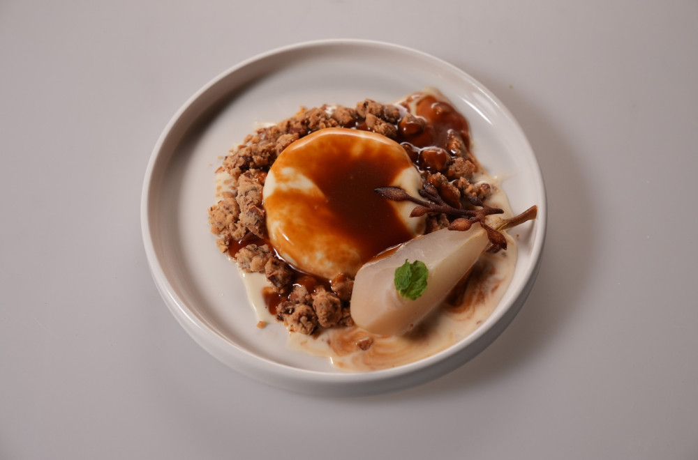

# Medena Panakota na Kramblu od Badema sa Pečenom Jabukom

### Panna cotta:
- 250ml nezasladjene pavlake za lupanje (30% + mlečne masti)
- 50ml mleka
- 50g meda
- 10-15 listova lavande
- 7g želatina rastvorenih u 30ml vode
- Kora od 1/4 pomorandže

#### Priprema:
U šerpici pomešati mleko, pavlaku, med i lavandu.
Kada dodje do tačke ključanja skloniti sa strane.
Narendati 1/4 kore od pomorandže.
Procediti nakon 5 minuta.
U maloj činijici pomešati nabubreni želatin sa 50ml vruće smese da se želatin rastopi pa dodati u ostatak smese u šerpi.
Naliti u ramikene ili posude za pana cottu i ostaviti u čileru da se stegne oko 25 minuta.
Ako koristite zamrzivač trebaće oko 2h.

### Krambl od badema:
- 60g brašna - prosejan
- 50g putera - hladan u kockicama
- 100g seckanih sirovih badema
- 10g šećera
- prstohvat soli
- Kora 1/2 pomorandže

#### Priprema:
Zagrejati rernu na 180 stepeni.
Staviti pek papir na pleh.
Rukama umešati sve sastojke osim pomorandže.
Smesa treba da bude rastresita tako da imate veće i manje komade krambla.
Smesu staviti na pek papir i ubaciti u rernu da se peče.
Izvaditi nakon 10-12 minuta ili kada krambl dobije zlatnu boju.
Kada se malo prohladi narendati 1/4 kore od pomorandže i ostaviti sa strane do servisa.

### Kruška:
- 200ml belog vina
- 40 ml ruma
- 300ml vode
- 4-5 zrna kardamoma (sa ljuspom)
- 1 kruška - oljuštena

U maloj šerpi pomešati sve tečnosti pa staviti oljuštenu krušku da se kuva.
Nagnječiti kardamom u avanu ili ručno i ubaciti u šerpu.
Kada tečnost proključa smanjiti vatru i prekriti pek papirom koji ste iskeli u obliku kruga sa rupom u sredini tako da bi se ukusi infuzirali brže.
Kuvati 45minuta ili dok kruška ne omekša.
Kada je gotova, iseći na četvrtine i nožem izvaditi žilu iz sredine i semenke.
Ostaviti sa strane do servisa.

### Karamel sos:
- 100g šećera 
- 60g nezasladjene pavlake za lupanje (30% + mlečne masti)
- Dva prstohvata soli

U manjem tiganju otopiti šećer.
Ne mešati!
Vrteti tiganj dok šećer ne dobije braon boju karamele.
Pavlaku zagrejati sa strane pa naliti u karamelizovani šećer.
Izmešati silikonskom marisom dok se smesa ne sjedini.
Poslotiti po ukusu ( 2 prstohvata ).
Ostaviti sa strane da se ohladi.

### Ukrasni tuli (touile):
- 60 g putera
- 60 g meda
- 60 g brašna
- 60 g belanaca

U secku ili malom blenderu pomešati odjednom sve sastojke.
Mutiti do kremaste smese, malo gušće od smese za palačinke.
Izliti u silikonske kalupe za ukrasni tuli pa izravnjati špatulom.
Staviti u rernu da se peče na plehu na 180 stepeni oko 7 minuta ili dok ne dobije zlatnu boju.
Izvaditi iz kalupa dok je topao i ohladiti na ravnoj površini.

### Servis:
Ugrejati ramiken sa panna cottom u vreloj vodi pa prevenuti na tanjir.
Preko panna cotte naliti 2-3 kašike karamele.
Okolo staviti krambl od badema i 1/4 kruške.
Preko kruške staviti 2-3 lista sveže nane.
Dodati ukrasni tuli između kruške i panna cotte.

