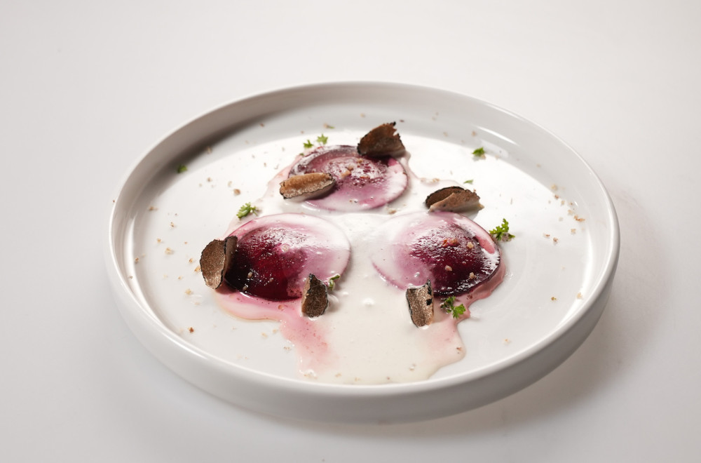

## Beetroot ravioli with black and white truffles, walnuts, and cream cheese

### Sastojci:
- 2-3 srednje cvekle
- 50 g oraha
- 150 g krem sira
- 50 g parmezana
- 1 beli tartuf (ili tartuf u prahu)
- 1 crni tartuf (ili tartuf u prahu)
- 50 g putera
- 400 ml pavlake za kuvanje
- 1 limeta
- 1 veza peršuna
- 1 list ili 1 kašičica želatina
- Maslinovo ulje
- So i biber po ukusu

### Priprema:

1. Kuvanje cvekle:

- Operite cveklu i skuvajte je u vodi dok ne postane mekana (oko 45 minuta do 1 sat, zavisno od veličine).

2. Priprema kreme od tartufa:

- Ugrejte pavlaku za kuvanje na laganoj vatri i dodajte izrendani beli tartuf. Kuvajte dok pavlaka ne poprimi aromu tartufa (oko 5 minuta). Dodajte želatin (pripremljen prema uputstvu) i mešajte dok se ne rastopi. Procedite pavlaku kroz cediljku i sipajte u ISI bocu (ako je nemate, možete koristiti i običan poslužitelj). Ostavite da se hladi u frižideru.

3. Punjenje za raviole:

- U posudi pomešajte krem sir, mlevene orahe, rendani parmezan, seckani peršun, maslinovo ulje, so i biber. Dobro sjedinite sve sastojke.

4. Priprema cvekle za raviole:

- Kada se cvekla skuva i ohladi, oljuštite je i isecite na tanke kolutove. Stavite kolutove na plastičnu foliju kako se ne bi osušili.

5. Punjenje raviola:

- Stavite malo punjenja između dva koluta cvekle, pažljivo pritisnite ivice da se zalepi, a po potrebi pospite malo brašna kako bi se lakše spojilo.

6. Prženje raviola:

- Na tiganju istopite puter i rendani beli tartuf i kratko sotirajte pripremljene raviole

7. Serviranje:

- Servirajte raviole na tanjir, prelijte ih kremom od pavlake i belog tartufa iz ISI boce, i na kraju narendajte crne tartufe preko svega. 

