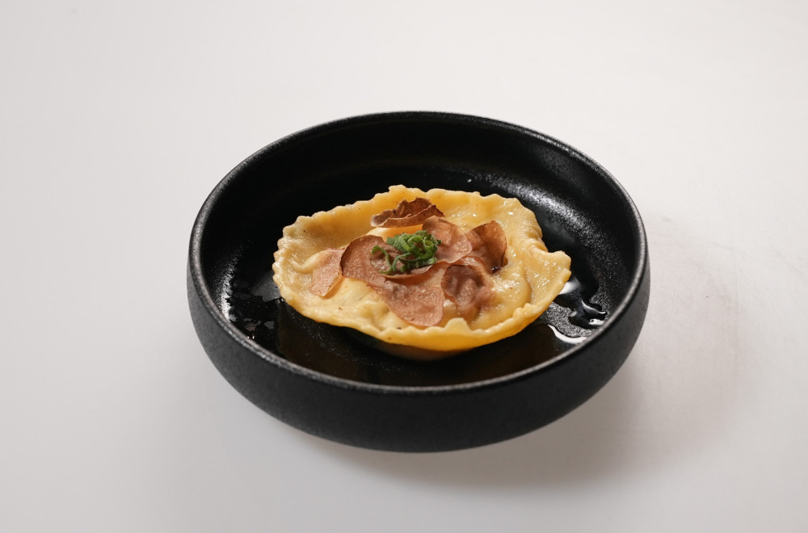

## Egg-filled ravioli with black and white truffles, cream cheese and mushrooms

### Sastojci:
- Svež beli i crni tartuf
- Crni tartuf u ulju
- Beli šampinjoni
- Braon šampinjoni
- Bukovača
- Crni luk - 1/2 manje glavice
- Pekorino romano
- Parmezan (parmesano reggiano)
- Krem sir (Philadelphia)
- Belo vino - 30 ml
- Belo brašno T-400 meko
- Jaja x 3
- Sitna so
- Biber
- Voda
- Maslinovo ulje
- Puter
- Sveža žalfija

### Pasta testo:
Izmeriti 100 g brašna i dodati prstohvat soli pa promešati.
Odvojiti jedno żumance.
Na čistu radnu površinu napraviti bunar od brašna i u sredinu staviti žumance i dve kašike vode, dve kašike ulja. Viljuškom iznutra mutiti smesu pa nastaviti rukama. Mesiti dok se smesa ne sjedini - oko 5-6 minuta. Uviti u streč foliju i ostaviti da odstoji minimum 25 minuta, idealno 30.

### Pasta punjenje:
Sitno naseckati crni luk, i po 2-3 pečurke svake vrste - bukovaču, braon i bele šampinjone. Na tiganju ugrejati dve kašike maslinovog ulja. Ubaciti crni luk i sotirati 2-3 minuta. Dodati pečurke i pobiberiti po ukusu. Dodati samo prstohvat soli, da pečurke puste vodu. Pržiti još 2-3 minuta. Naliti sa belim vinom i pržiti dok vino ne ispari. Smesu prebaciti da ubrus papir kako bi se ocedio višak masnoće. U činiji pomešati 5 kašika krem sira, pečurke i luk pa narendadi kašiku pekorina i kašiku parmezana. Narednadi svež beli tartuf i dodati u smesu. Na sitno iseckati crni tartuf iz ulja i dodati u smesu uz dodatak 1 kašike ulja u kom su bili u tegli. Odvojiti jedno žumance sa strane.

### Priprema raviola:

1.  Testo koje je odstojalo premesiti na povrašnjenoj površini. Istanjiti mašinom na 1mm ili najmanje podešavanje tako da se blago provide prsti ispod testenine. Kružnim kalupima izvući krugove testa.

2.  Razbiti jedno žumance i umutiti u posebnoj činiji pa prvi krug testa po ivici premazati žumancetom. To će biti lepak za gornji sloj paste.

3.  Na sredinu kruga staviti krem sir punjenje, tako da u sredini ostane rupa za žumance. Pažljivo staviti žumance u sredinu. Prekriti drugim krugom testa i nežno izbaciti sav vazduh. Proveriti da su ivice zalepljene.

4.  Kuvati u slanoj ključaloj vodi 2 minuta, tako da se testo skuva a žumance ostane tečno.

5.  U tiganju ugrejati dve kašike putera i dodati 3-4 lista sveže žalfije da se puter aromatizuje. Kuvanu ravioli prebaciti u puter i zalivati 1 minut.

### Servis:
U manji duboki tanjir staviti kašiku putera od žalfije i ulje od tartufa. Dodati raviolu preko. Narendati pola manjeg svežeg belog tartufa preko, i tanko isečen list sveže žalfije. 

