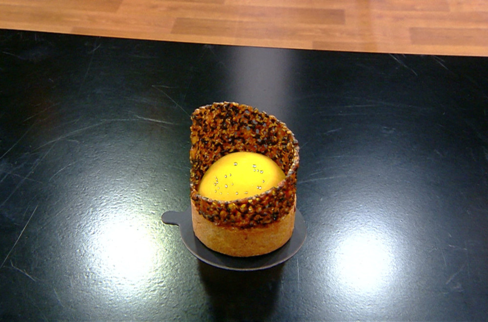

# Samba Tart by Krsto

### Tonka genaž:
- Mlečna čokolada   350g
- Slatka pavlaka   250g
- Tonka mahuna 1 komad
- Glukoza    10g

Prokuvati pavlaku
Izrendati tonku u pavlaku
Preliti preko čokolade 
Izmiksati ručni blenderom 
Sipatu u tart I stavitu u šok komoru(čileru) da se stegne 

### Testo za tart:
- Brašno 500g
- Puter 200g
- Šećer u prahu 125g
- Mleveni badem 70g
- Jaja 4 kom
- Prstohvat soli   1
- Pola mahune vanile

Dodati jaja na kraju I umesiti glatko testo
Pomešati sve namernice u miskeru sa lopatom dok se ne sjedine I neki komadić putera
Razvući na pleh da se ohladi min 20 min
Odmoreno testo razvući I iseći modlom
Odmoriti
Ubaciti u puterom podmazani kalup
Odmoriti
Staviti zaštitu od papira I napuniti pirinčom
Peći na 180C   15-18 min do zlatno braon boje
Ohladiti i napuniti genažom 

### Džem od jagode:
- Pire od jagode ili zamrznuta jagoda 300g
- Šećer 50g
- Pectin 8g
- Vanilla mahuna 1/4

Pire zagrejati do 40C
Pomešati pectin i  šećer 
Dodati u pire i prokuvati 
Sipati u modle I zalediti 

### Aromatični krem od marakuje:
- Slatka pavlaka 250g
- Pire od marakuje 250g
- Žumance 90g
- Šećer 80g
- Želatin masa 36g

Prokuvati odvojeno pavlaku i pire od marakuje u odvojenim šerpama
Promešati šećer i  žumanca 
Sve spojiti i kuvati do 80C
Dodati želatin na kraju
Promešati ručnim blenderom 
Sipati u modle 
Kada je polu zaleđeno ubaciti insert od jagode 

### Hrskavi tuli od susama:
- Brašno 90g
- Šećer 300g
- Glukoza 50g
- Crni susam 80g
- Beli susam 80g 
- Karamelizovani lešnik Callebaut 20g
- Voda 90g
- Istopljeni puter 120g

Prokuvati vodu I glukozu
Dodati šećer I prokuvati
Spojiti sve sirovine I dobro promešati 
Odmoriti 30 min
Razvući između dva papira- odmoriti u šok komori 15 min
Peći na 180 C  15 min do zlatno braon boje 
Iseći na pravougaonik zatim po dijagonali
Uviti oko kalupa 

### Način izrade kolača I plan rada 

- Napraviti testo-ostaviti da se odmori
- Skuvati džem od jagode I izliti u modle. Zalediti
- Skuvati tuli. Odmoriti
- Skuvati krem od marakuje-ohladiti 
- Razvući tart 
- Ubaciti tart testo u modle I ostaviti  da  se hladi
- Ubaciti insert od jagode u marakuja krem koji se stegao- ne sme da se zaledi. Treba da bude gust da može da zadrži insert da ne propadne. Ne sme da se zaledi! 
- Ubaciti krem u šok komoru da se zaledi. 
- Ispeći tart
- Razvući tuli između dva papira. Odmoriti tuli u šok komori 10 min
- Ispečeni tart ostaviti da se ohladi. Izvaditi papir I pirinač I staviti ga u šok komoru da se ohladi
- Staviti tuli da se peče 
- Napuniti tart sa genažom I vratiti ga u šok komoru
- Završiti tuli
- Preliti marakuja krem neutralnom glazurom
- Staviti krem preko tarta 
- Staviti dekoraciju

