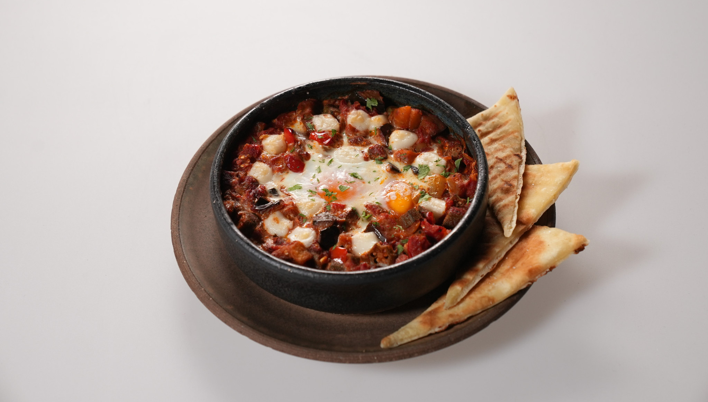

## Shakshuka

### Sastojci:

#### Šakšuka: 
- 1 srednji plavi patlidžan
- 1 konzerva seckanih paradajza
- 5 osrednjih bamija
- ½ žute paprike
- ½ crvene paprike
- 1 glavica crnog luka
- 1 čen belog luka
- 1/3 kašičice kurkume
- 1/3 kašičice kumina
- 2 jaja
- Prstohvat seckanog peršuna

#### Flat bread (hlepčići):
- 225 g mekog belog brašna
- Oko 100 ml tople vode
- ½ kesice suvog kvasca
- Prstohvat soli
- Prstohvat šećera

### Postupak:
Iseckati plavi patlidžan na kocke i posoliti. Sačekati 10ak minuta da se izvuče gorčina. Upržiti crni, beli luk te dodati plavi patlidžan. Dodati kurkumu i kumu. Zatim ubaciti paradajz i krčkati 20ak minuta. Prebaciti sadržaj tiganja u posudu koja može u rernu, te dodati jaja i koziji sir. Peći dok se belanca termički ne obrade, a žumanca ostanu rovita. Izvući iz rerne i posuti peršunom.
Za hleb pomešati brašno, so i šećer, zatim kvasac i vodu. Dok se testo ne formira. Premesiti, ostaviti da odstoji 20ak minuta. Zatim podeliti na manje komade i oklagijom formirati hlebiće. Pržiti hleb na tiganju. 

