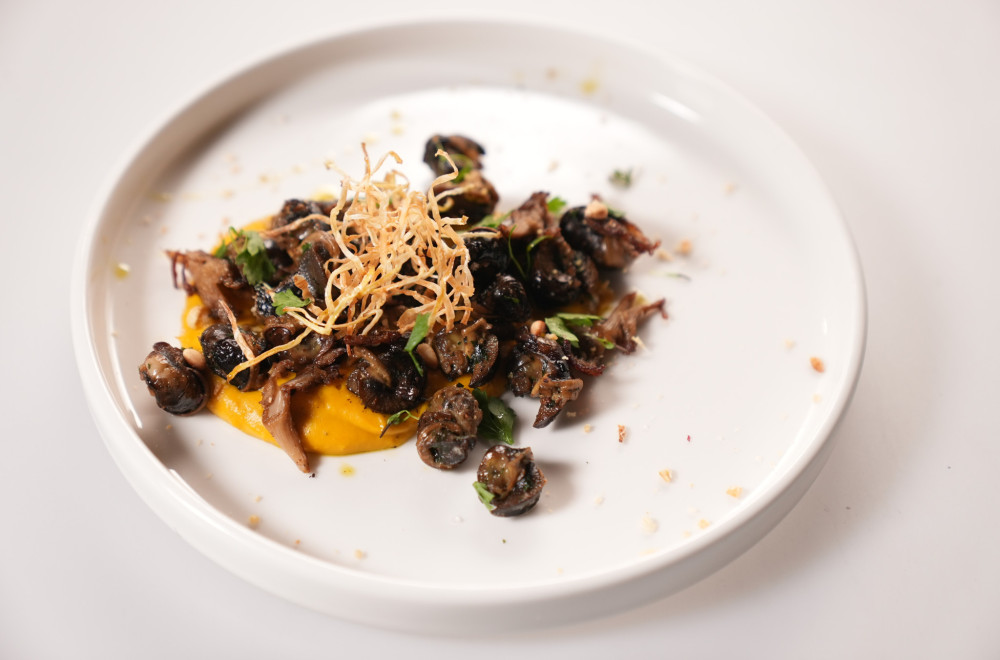

# Puzevi na pireu od bundeve sa celerom i bukovacom

#### Sastojci:
- 12 puzeva
- 1 Hokkaido bundeva
- 1 veza persuna
- 2 kasike putera
- 50ml burbon viskija
- 1 celer
- 100g bukovace
- maslinovo ulje
- so
- biber
- mleko ili pavlaka za kuvanje
- pinjoli (za posipanje)

#### Priprema budeve:
Rernu zagrejati na 200°C.
Bundevu prepoloviti, očistiti od semena i staviti na papir za pečenje.
U svaku polovinu bundeve staviti malo majčine dušice, posoliti i dodati komade putera.
Peći bundevu u prethodno zagrejanoj rerni oko 30-40 minuta, ili dok ne omekša.
Kada se bundeva ohladi, izvaditi je iz kore i iseći na sitne kockice. Sačuvati sokove koje je bundeva pustila. 

#### Priprema pire od bundeve:
Na malo ulja ili putera propržiti sitno iseckani crni luk dok ne omekša.
Dodati iseckanu bundevu i propržiti još nekoliko minuta.
Dodati burbon viski i flambirati (oprezno zapalite viski, pa ga ugasite čim se plamen ugasi).
U blender staviti bundevu, sačuvane sokove i puter iz bundeve, onda mleko ili pavlaku za kuvanje.
Blendati dok ne dobijete glatku masu. Ako je pire previše redak, kuvajte ga na laganoj vatri dok ne postigne željenu gustinu.
Začiniti po ukusu solju i biberom. 

#### Priprema puževa:
Puževe skuvati u vodi sa malo soli, prema uputstvu na pakovanju.
Kada su kuvani, na tiganju rastopiti puter i dodati sitno iseckani peršun.
Sotirati puževe na tiganju sa puterom i peršunom dok ne dobiju zlatno-smeđu boju.

#### Priprema celera i bukovače:
Celer iseći na tanke štapiće (julienne) i pržiti u dubokom ulju dok ne postane hrskav.
Bukovaču posoliti i sotirati na malo maslinovog ulja dok ne omekša i dobije lepu zlatnu boju. 

#### Serviranje:
Na tanjir staviti pire od bundeve kao podlogu.
Na pire poređati puževe.
Na nekoliko mesta rasporediti sotiranu bukovaču.
Oko puževa posuti hrskavim celerom.
Po želji pospite tostiranim pinjolima. 

