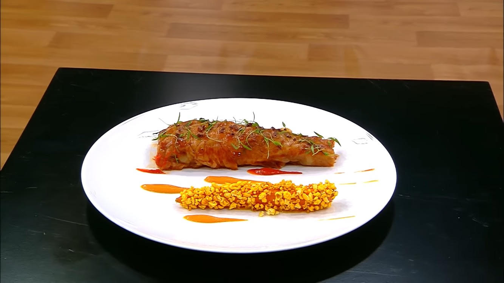

# Sweet Cabbage with Carrots

### Slatki kupus
#### Sastojci:  
- Kupus srednje veličine 2kom
- Crni luk isečen na krupne kocke 2kom
- Šargarepa isečena na krupne kocke 3 kom
- Celer štap isečen na krupnije kocke ½ kom
- Ljuta paprika ½ kom
- Lovor
- Biber
- Dimljena mlevena paprika
- Majčina dušica
- So
- Beli luk 1 čena zgnječena
- Paradajz pire 100g
- Ulje od grožđice

#### Priprema: 
Zagrejati šerpu, dodati ulje, pa pržiti povrće dok ne postane zlatno braon boje. Dodati pire od paradajza, pa ponovo karamelizovati. Dodati začine.
Glavice mladog kupusa iseći na pola i ostaviti je SA korenom. Staviti u šerpu, sa povrćem. Posoliti i naliti povrtnim fondom do 2/3 visine kupusa. Dovesti do tačke ključanja, pa poklopiti i kuvati u rerni cca 90min. Kupus treba da bude lepo i ravnomerno kuvan. Izvaditi ga iz tečnosti i ostaviti da se ohladi.
Sos redukovati tako da bude teksture glazure.
Ohlađeni kupus odvojiti od glavnog korena, a manje korenje poravnati- vodeći računa da listovi ostanu celi. Listove dobro posušiti, pa ih mazati redukovanom glazurom i ređati jedan na drugi. Srolati ih u oblik cigare- dno uže, vrh širi. 

### Pire od šargarepe:
- Šargarepa (oljuštena i isečena na kolutove) 600gr
- Tonka 1/3 kom
- Štap cimeta 5cm
- Maslinovo ulje 100gr
- Pire od kokosa „Sicoly“ 30gr
- So QS

Šargarepu pržiti na maslinovom ulju da se blago karamelizuje.
Dodati cimet štap (tako da može da se izvadi pre blendanja) i izrendati 1/3 tonke.
Kada je šargarepa skuvana, dodati pire od kokosa, pa napraviti gladak pire.
Posoliti po ukusu. 

### Sos od šargarepe:
- Sok od šargarepe 375gr
- Maslinovo ulje 75gr
- Paradajz pire 4gr
- Vinsko sirće 8gr
- Soja sos 6gr
- Ulje od tartufa 2gr
- So QS

Sok od šargarepe redukovati na 150gr. Ohladiti, pa dodati ostale sastojke i dobro emulzifikovati. Sos treba da bude kompaktan. 

### Kuvana šargarepa: 
- Šargarepa mlada i ne previše velika (10cm)
- Sok od šargarepe 180gr
- Soja sos 18gr
- Vinsko sirće 10gr
- Ulje od tartufa 2gr
- Lemongrass 6gr
- Đumbir 4gr

Oljuštiti šargarepu tako da zadrži svoj prirodan oblik.
Iseckati lemongrass i đumbir, pa pomešati sa ostalim- ečnim sastojcima.
Šargarepu staviti u vakuum kesu, naliti sa prethodno spremljenim bujonom i vakumirati na maksimum.
Kuvati na pari cca 30 min.
Izvaditi šargarepu iz kese, pa je staviti u šnezider (pogodne veličine) i procediti sokove iz kese. Kuvati šargarepu sa sokom, konstantno mešajući ili vrteći šnezider. Ovo treba da se izvede brzo i na jakoj vatri, jer želimo samo da glaziramo šargarepu i da oko nje imamo sirupasti sloj. 

### Kokice:
- Kukuruz kokičar 30gr
- Suncokretovo ulje QS
- Kurkuma 5gr
- Dimljena mlevena paprika QS
- So QS

Zagrejati šerpu, sipati ulje i iskokati kokice. Ohladiti ih.
U mikseru, grubo samleti kokice i pomešati ih sa začinima i soli. Mlevene kokice treba da budu veličine pinjola. 

### Pire od paprike i maline:
- Crni luk, sitno seckan 1kom
- Pečena paprika (filet) isečena na žilijen 500gr
- Pire od maline „Sicoly“
- Ulje od grožđice

U šerpi ispržiti luk tako da bude staklast i kuvan. Dodati pečenu papriku i blago je upržiti. Naliti sa povrćnim bujonom i kuvati dok ne bude pogodna za purifikovanje.
Izblendati papriku tako da se dobije nežan i gladak pire. U pire dodati pire od maline- 30% od ukupne težine pirea od paprike. (Na 1000gr pirea od paprike- 300gr pirea od maline. ) Doterati ukus sa malo soli. 

### Ostalo: 
- Lomljeno zrno kakaoa
- Krbuljica (chervil) klice
- Fleur de sel

### Servis:
Zagrejati kupus. Glaziranu šargarepu uvaljati u kokice.
Na velikom belom tanjiru servirati pire od paprike i pire od šargarepe. Pire od paprike ide sa desne strana, a od šargarepe sa leve.
Na pire od šargarepe se servira šargarepa sa kokicama.
Na pire od maline servirati kupus.
Preko kupusa staviti malo lomljenog zrna kakaoa, šervila i fleur de sel.
Sos od šargarepe servirati hladan- sa strane.

