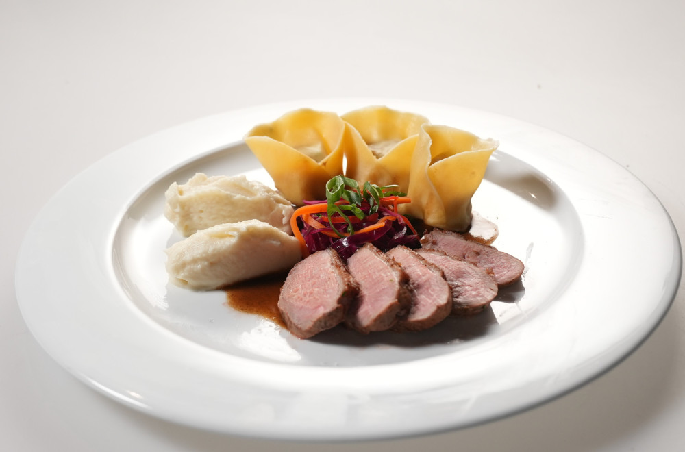

# Thyme Patka

### Ukiseljeno povrće:
- Šargarepa
- Crveni kupus
- Beli kupus
- Celer
- Vinsko sirće
- Šećer
- Voda
- Ljuta papričica
- Đumbir

Sve povrće iseći na tanak žilijen, rastopiti šećer u sirćetu, naliti vodom, dodati dok je mlako đumbir i ljutu
papričicu. Preliti svo povrće i vakumirati u vakuum kesu, pustiti da se ohladi.

### Patka:

Patku tranžirati. Odvojiti batake i file grudi. Ostatak kostiju i krilca skinuti, višak masne kože, raskomadati na manje parčiće za sos.

### Pačiji sos:
- Kosti i krilca patke
- Korenasto povrće
- Luk
- Paradajz pasta
- Hoisin sos
- Tamari (dark soy) sos
- Kockica đumbira
- Crveno vino
- Kora pomorandže (opciono)

U šerpi karamelizovati kosti i povrće, zatim dodati paradajz pastu, sipati crveno vino i dodati vodu.
Kuvati dok se ne ukuva, procediti, redukovati i začiniti preostalim sastojcima.

### Konfitirani batak:
- Pačiji bataci
- Ostatak povrća (npr. šargarepa, celer, praziluk, luk)
- Majčina dušica
- Suncokretovo ulje
- Beli luk

Batake otvoriti nožem do kosti da bi brže bili gotovi i staviti u rernu da se konfitiraju najmanje 1 sat i
15 minuta na 180°C. Kad su gotovi, natrgati ih ili iseći na sitnije komade.

### Raviola:
- Brašno
- Jaja
- Maslinovo ulje
- Voda
- Konfitirani batak
- Đumbir
- Tamari (soy) sos
- Mirin
- Beli luk
- Mladi luk
- Malo pačijeg sosa

Napraviti testo za pastu. Napraviti fil od konfitiranog bataka sa svim gore navedenim sastojcima,
dodati pačiji sos koliko je potrebno da fil bude sočan i kompaktan. Napuniti raviole i pred sam servis ih skuvati.

### Pačiji file:

Peći na tiganju, završiti pečenje u rerni, pustiti da odstoji pre sečenja.

### Celer pire:
- Celer
- Mleko
- Voda
- Puter
- Pavlaka za kuvanje
- Majčina dušica

Skuvati celer u mleku i vodi sa začinima, izblendati, dodati pavlaku i puter za teksturu i punoću ukusa.

### Servis:
Mladi luk i vlašac iseći za serviranje. 

